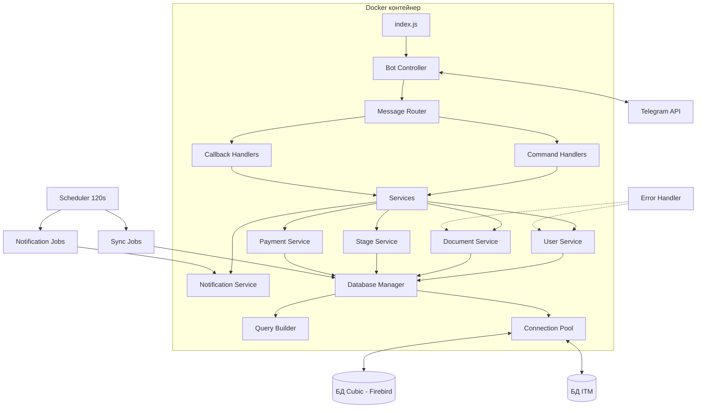
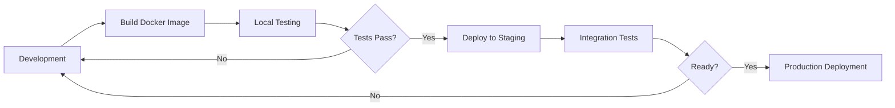
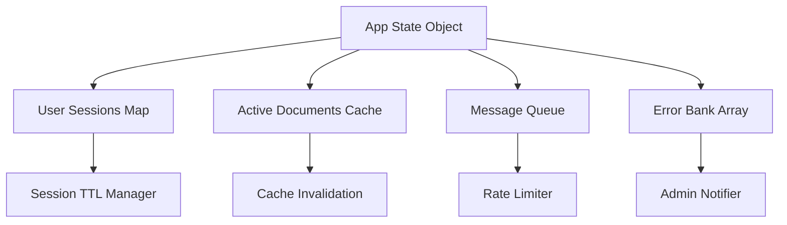
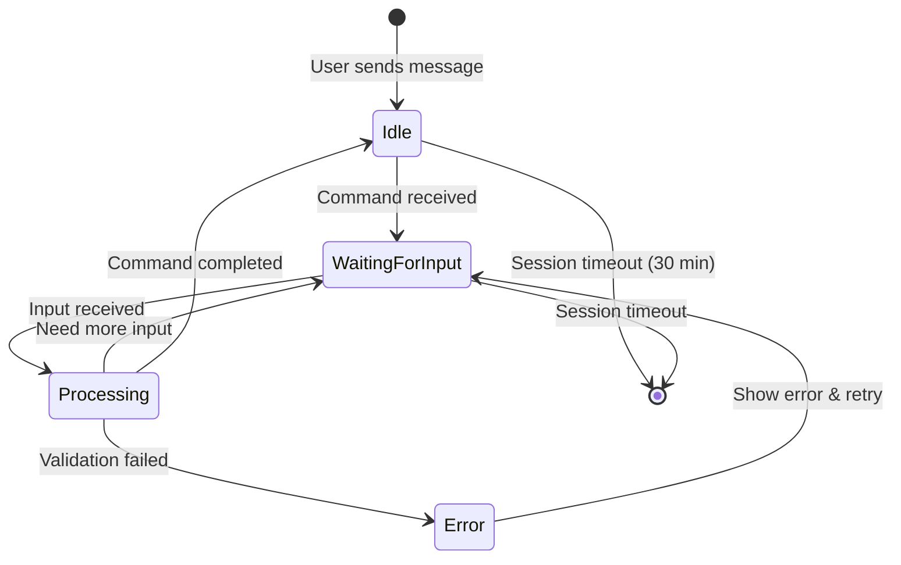
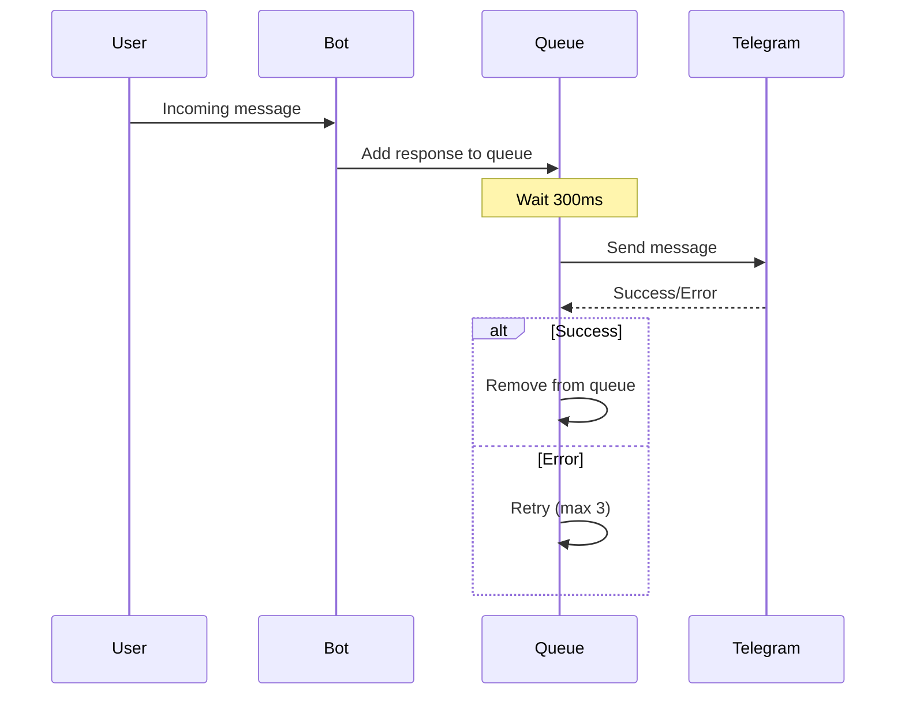
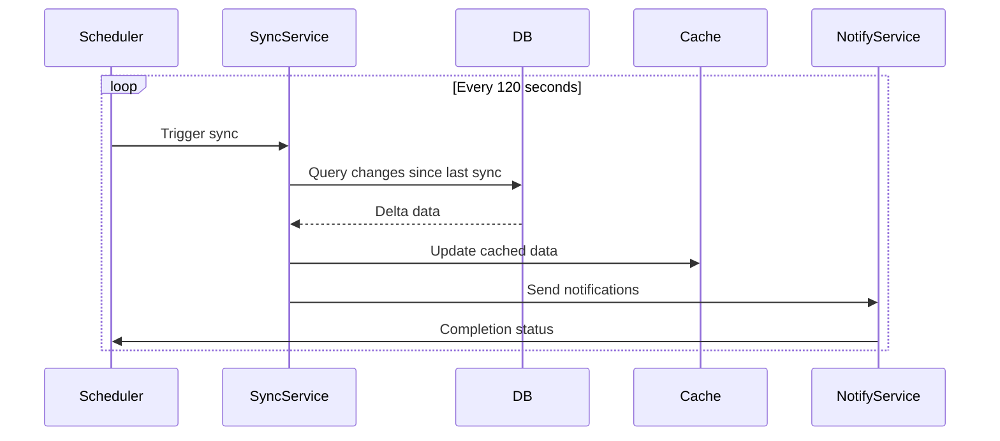
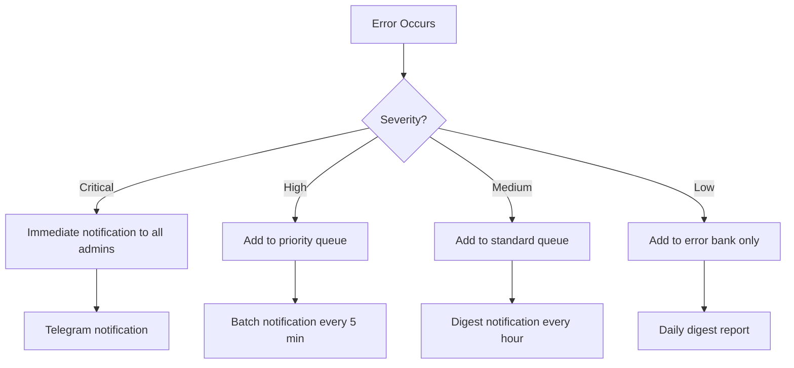
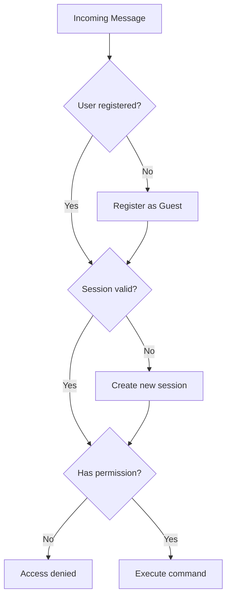
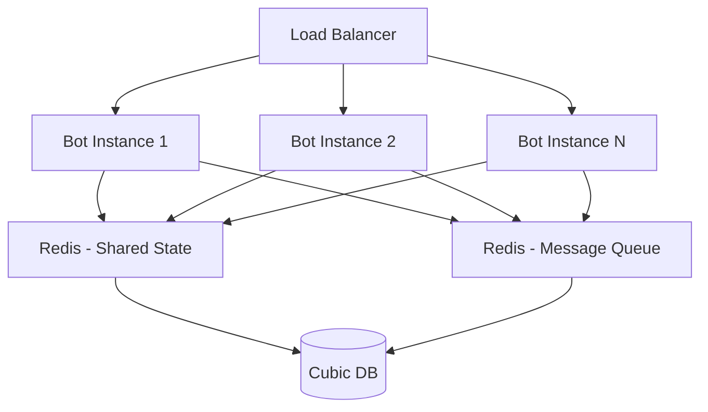
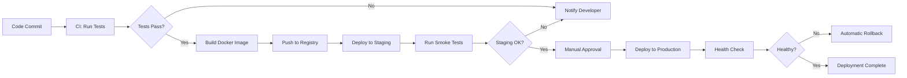

# Dockerизация Telegram бота с Node-RED на автономный сервер

## Обзор проекта

Документ описывает стратегию миграции Telegram бота с Node-RED архитектуры на автономное контейнеризованное Node.js приложение. Бот управляет документами, пользователями, этапами, платежами и денежными потоками с интеграцией к БД Cubic (Firebird) и ITM.

## Текущее состояние

### Архитектура Node-RED

**Характеристики:**
- Flow-based execution через связанные function узлы
- Состояние приложения в flow context (flow.get/set)
- Две БД: Cubic (основная) и ITM через database узлы
- Telegram сообщения через telegram узлы
- Периодические задачи через inject узлы (120 секунд)

### Основная функциональность

| Модуль | Ответственность |
|--------|------------------|
| Управление пользователями | Регистрация, аутентификация, 7 ролей, профили |
| Управление документами | CRUD документов с многоэтапным workflow |
| Управление этапами | Этапы с материалами, ценообразованием, расчетами объемов |
| Обработка платежей | Платежи, авансы, кассовые операции, типы оплаты |
| Система уведомлений | Банк сообщений с очередью и rate limiting |
| Обработка ошибок | Банк ошибок с логированием и уведомлениями админов |
| Синхронизация данных | Периодическая синхронизация с БД каждые 120 секунд |

### Система ролей

| ID | Роль | Права |
|----|------|-------|
| 1 | Гость | Ограниченный доступ |
| 2 | Клиент | Просмотр своих данных |
| 3 | Агент | Управление документами, пользователями |
| 4 | Контрагент | Доступ партнера |
| 5 | Плательщик | Платежи, финотчеты |
| 6 | Менеджер | Управление заказами |
| 7 | Администратор | Полный доступ |

## Целевая архитектура

### Технологический стек

| Компонент | Технология | Обоснование |
|-----------|------------|-------------|
| Runtime | Node.js v18+ LTS | Async/await, совместимость с текущим кодом |
| Framework | Express.js | Легковесный, минимальные накладные расходы |
| Telegram SDK | node-telegram-bot-api | Устоявшаяся библиотека, полное покрытие API |
| БД драйвер | node-firebird | Прямое подключение к Firebird/InterBase (Cubic) |
| Process Manager | PM2 | Управление процессами, авто-рестарт, логи |
| Container | Docker | Изоляция, портативность |
| Оркестрация | Docker Compose | Multi-container управление |

### Диаграмма архитектуры



### Структура проекта

```
telegram-bot/
├── src/
│   ├── index.js
│   ├── config/
│   │   ├── database.js
│   │   ├── telegram.js
│   │   └── constants.js
│   ├── controllers/
│   │   ├── botController.js
│   │   └── messageRouter.js
│   ├── handlers/
│   │   ├── commandHandlers.js
│   │   ├── callbackHandlers.js
│   │   └── messageHandlers.js
│   ├── services/
│   │   ├── userService.js
│   │   ├── documentService.js
│   │   ├── stageService.js
│   │   ├── paymentService.js
│   │   ├── notificationService.js
│   │   └── errorService.js
│   ├── models/
│   │   ├── User.js
│   │   ├── Document.js
│   │   ├── Stage.js
│   │   ├── Element.js
│   │   └── enums.js
│   ├── database/
│   │   ├── connection.js
│   │   ├── queryBuilder.js
│   │   └── repositories/
│   ├── middleware/
│   │   ├── authentication.js
│   │   ├── authorization.js
│   │   └── errorHandler.js
│   ├── utils/
│   │   ├── formatters.js
│   │   ├── validators.js
│   │   ├── keyboards.js
│   │   └── buttons.js
│   └── schedulers/
│       ├── syncScheduler.js
│       └── notificationScheduler.js
├── docker/
│   ├── Dockerfile
│   └── docker-compose.yml
├── .env.example
├── package.json
└── README.md
```

## Стратегия миграции

### Этап 1: Анализ и подготовка

**Цели:**
- Извлечь весь JavaScript код из function узлов Node-RED
- Идентифицировать зависимости между узлами
- Документировать flow context переменные
- Определить все используемые stored procedures в БД

**Ключевые переменные состояния:**

| Переменная | Область | Назначение |
|------------|---------|------------|
| App | flow.global | Основное состояние приложения |
| ErrorsBank | flow.global | Коллекция необработанных ошибок |
| deltatime | flow.local | Временные метки для синхронизации |
| user sessions | runtime | Контекст текущих пользовательских сессий |

### Этап 2: Декомпозиция функциональности

**Преобразование Node-RED узлов:**

| Node-RED узел | Целевой компонент | Назначение |
|---------------|-------------------|------------|
| telegram receiver | botController.on('message') | Прием входящих сообщений |
| function: init App | index.js initialization | Инициализация приложения |
| function: user handler | userService + commandHandlers | Обработка пользовательских команд |
| function: document CRUD | documentService | Операции с документами |
| database cubic | connection.js (Cubic pool) | Подключение к основной БД |
| inject (120s) | syncScheduler.js | Периодическая синхронизация |
| telegram sender | botController.sendMessage() | Отправка ответов пользователям |
| error handler | errorService + middleware | Централизованная обработка ошибок |

### Этап 3: Модульная разработка

**Приоритет разработки модулей:**

1. **База (неделя 1)**
   - Настройка проекта, package.json, Docker окружение
   - Database connection manager с поддержкой Cubic и ITM
   - Базовая инициализация Telegram бота
   - Конфигурация через environment variables

2. **Аутентификация (неделя 2)**
   - User service с регистрацией/авторизацией
   - Middleware для проверки ролей
   - Session management для пользовательских контекстов
   - Миграция stored procedures: TGP_CREATE_USER, TGP_EDIT_USER

3. **Основная бизнес-логика (недели 3-4)**
   - Document service с полным CRUD
   - Stage service с управлением этапами
   - Element service для управления элементами
   - Payment service для обработки платежей
   - Stored procedures: TGP_*_DOCUMENT, TGP_*_STAGE, TGP_*_ELEMENT

4. **Вспомогательные системы (неделя 5)**
   - Notification service с очередью сообщений
   - Error service с банком ошибок и уведомлениями админов
   - Scheduler для 120-секундной синхронизации
   - Rate limiting для сообщений (300ms интервал)

5. **Интеграция и тестирование (неделя 6)**
   - Интеграция всех модулей
   - End-to-end тестирование основных сценариев
   - Стресс-тестирование с множественными пользователями
   - Финализация Docker конфигурации

### Этап 4: Контейнеризация

**Docker стратегия:**



**Компоненты контейнера:**
- Base image: node:18-alpine
- Multi-stage build для оптимизации размера
- Healthcheck endpoint для мониторинга
- Volume mounts для логов и конфигурации
- Network isolation для безопасности

## Конфигурация среды

### Переменные окружения

| Переменная | Тип | Описание | Пример |
|------------|-----|----------|--------|
| TELEGRAM_BOT_TOKEN | string | API токен Telegram бота | 123456:ABC-DEF... |
| CUBIC_DB_HOST | string | Хост БД Cubic | localhost |
| CUBIC_DB_PORT | number | Порт БД Cubic | 3050 |
| CUBIC_DB_DATABASE | string | Путь к БД файлу | /path/to/cubic.fdb |
| CUBIC_DB_USER | string | Пользователь БД | SYSDBA |
| CUBIC_DB_PASSWORD | string | Пароль БД | masterkey |
| ITM_DB_HOST | string | Хост БД ITM | localhost |
| ITM_DB_PORT | number | Порт БД ITM | 3050 |
| ITM_DB_DATABASE | string | Путь к БД файлу ITM | /path/to/itm.fdb |
| ITM_DB_USER | string | Пользователь БД ITM | SYSDBA |
| ITM_DB_PASSWORD | string | Пароль БД ITM | masterkey |
| SYNC_INTERVAL | number | Интервал синхронизации (сек) | 120 |
| MESSAGE_RATE_LIMIT | number | Rate limit для сообщений (мс) | 300 |
| LOG_LEVEL | string | Уровень логирования | info |
| NODE_ENV | string | Окружение | production |

### Подключение к базам данных

**Конфигурация пула соединений:**

| Параметр | Значение | Обоснование |
|----------|----------|-------------|
| min | 2 | Минимальное кол-во активных соединений |
| max | 10 | Максимальное кол-во соединений в пуле |
| idleTimeoutMillis | 30000 | Таймаут простоя соединения |
| connectionTimeoutMillis | 5000 | Таймаут установки соединения |
| retryDelay | 3000 | Задержка перед повторной попыткой |
| maxRetries | 3 | Максимальное кол-во повторов |

**Обработка потери соединения:**
- Автоматический retry с exponential backoff
- Circuit breaker pattern для защиты от каскадных сбоев
- Fallback механизмы для критических операций
- Логирование всех ошибок подключения в ErrorsBank

## Управление состоянием

### Замена Flow Context

Node-RED использует flow.get/set для управления состоянием. В автономном приложении это заменяется на:

**In-memory state management:**



**Структура состояния приложения:**

| Компонент | Тип данных | Назначение |
|-----------|------------|------------|
| isRestarting | boolean | Флаг перезапуска приложения |
| buttons | object | Конфигурация inline кнопок |
| keyboards | object | Конфигурация reply клавиатур |
| users | Map<userId, User> | Кэш пользователей |
| documents | Map<docId, Document> | Кэш активных документов |
| sessions | Map<chatId, Session> | Пользовательские сессии |
| messageQueue | Array<Message> | Очередь исходящих сообщений |
| errorBank | Array<Error> | Непросмотренные ошибки |

**Utility functions (из Node-RED App object):**

| Функция | Сигнатура | Назначение |
|---------|-----------|------------|
| evaluate | evaluate(str: string) => any | Безопасное выполнение выражений |
| phoneMask | phoneMask(phone: string) => string | Форматирование телефона |
| validateEmail | validateEmail(email: string) => boolean | Валидация email |
| formatMonetary | formatMonetary(value: number) => string | Форматирование денежных сумм |

### Session Management

**Жизненный цикл сессии:**



**Session data structure:**

| Поле | Тип | Описание |
|------|-----|----------|
| userId | number | ID пользователя Telegram |
| chatId | number | ID чата |
| state | enum | Текущее состояние сессии |
| context | object | Контекст текущей операции |
| lastActivity | timestamp | Время последней активности |
| currentCommand | string | Выполняемая команда |
| tempData | object | Временные данные для multi-step операций |

## Обработка сообщений

### Message Queue

**Цель:** Предотвратить rate limiting от Telegram API и гарантировать порядок сообщений.

**Механизм:**
- FIFO очередь для исходящих сообщений
- Обработка с интервалом 300ms (из Node-RED: "repeat": "0.3")
- Приоритизация ошибок и критических уведомлений
- Retry логика для failed сообщений



### Command Routing

**Стратегия маршрутизации:**

| Pattern | Handler | Примеры |
|---------|---------|----------|
| /start | commandHandlers.start | Инициализация бота |
| /help | commandHandlers.help | Справка |
| /menu | commandHandlers.menu | Главное меню |
| callback_query | callbackHandlers.route | Обработка inline кнопок |
| text message | messageHandlers.processText | Обработка текста в контексте сессии |
| document | messageHandlers.processDocument | Обработка файлов |
| contact | messageHandlers.processContact | Обработка контактов |

## Синхронизация данных

### 120-секундный цикл

**КРИТИЧЕСКИ ВАЖНО:** Сохранить интервал 120 секунд из Node-RED flows.

**Задачи синхронизации:**

1. **Обновление списка пользователей**
   - Запрос изменений из БД Cubic
   - Обновление локального кэша users
   - Инвалидация устаревших сессий

2. **Обновление документов**
   - Запрос активных документов
   - Синхронизация статусов
   - Обновление кэша documents

3. **Обработка платежей**
   - Проверка новых транзакций
   - Обновление балансов
   - Генерация уведомлений

4. **Проверка ошибок**
   - Анализ ErrorsBank
   - Группировка повторяющихся ошибок
   - Отправка дайджеста администраторам

**Диаграмма процесса:**



## Обработка ошибок

### Error Bank

**Концепция:** Централизованное хранилище ошибок для анализа и уведомления администраторов.

**Структура ошибки:**

| Поле | Тип | Описание |
|------|-----|----------|
| timestamp | datetime | Время возникновения |
| type | enum | Тип ошибки (DB, API, Validation, System) |
| severity | enum | Критичность (Low, Medium, High, Critical) |
| module | string | Модуль, где произошла ошибка |
| userId | number | ID пользователя (если применимо) |
| message | string | Сообщение об ошибке |
| stack | string | Stack trace |
| context | object | Контекстная информация |
| resolved | boolean | Флаг обработки |

**Стратегия уведомлений:**



### Retry Strategies

**По типу операции:**

| Операция | Max Retries | Delay Strategy | Fallback |
|----------|-------------|----------------|----------|
| DB Query | 3 | Exponential (1s, 2s, 4s) | Cache/Error response |
| Telegram API | 5 | Linear (2s) | Queue for later |
| HTTP Request | 3 | Exponential (500ms, 1s, 2s) | Default value |
| File Operation | 2 | Linear (1s) | Error to user |

## Мониторинг и логирование

### Логирование

**Уровни логов:**

| Уровень | Использование | Примеры |
|---------|---------------|----------|
| error | Критические ошибки | DB connection failed, API error |
| warn | Предупреждения | Deprecated API usage, high memory |
| info | Информационные | User login, command executed |
| debug | Отладочные | Function entry/exit, variable values |
| trace | Детальные | SQL queries, API requests |

**Структура лог-записи:**

| Поле | Описание |
|------|----------|
| timestamp | ISO 8601 timestamp |
| level | Уровень лога |
| service | Название сервиса |
| module | Модуль/файл |
| userId | ID пользователя (если есть) |
| message | Сообщение |
| context | Дополнительная информация |
| duration | Время выполнения (для операций) |

### Метрики

**Ключевые метрики для мониторинга:**

| Метрика | Тип | Назначение |
|---------|-----|------------|
| active_users_count | gauge | Количество активных пользователей |
| messages_per_minute | counter | Скорость обработки сообщений |
| db_query_duration | histogram | Время выполнения запросов к БД |
| error_rate | counter | Частота ошибок |
| memory_usage | gauge | Использование памяти |
| cpu_usage | gauge | Использование CPU |
| queue_length | gauge | Размер очереди сообщений |
| sync_duration | histogram | Время синхронизации данных |

## Безопасность

### Аутентификация и авторизация

**Уровни проверки:**



**Permission matrix:**

| Resource | Guest | Client | Agent | Counterparty | Payer | Manager | Admin |
|----------|-------|--------|-------|--------------|-------|---------|-------|
| View own profile | ✓ | ✓ | ✓ | ✓ | ✓ | ✓ | ✓ |
| Edit own profile | - | ✓ | ✓ | ✓ | ✓ | ✓ | ✓ |
| View documents | - | Own | All | Related | Related | All | All |
| Create documents | - | - | ✓ | - | - | ✓ | ✓ |
| Edit documents | - | - | ✓ | - | - | ✓ | ✓ |
| Delete documents | - | - | - | - | - | - | ✓ |
| View payments | - | Own | Related | Related | All | All | All |
| Create payments | - | - | ✓ | - | ✓ | ✓ | ✓ |
| Manage users | - | - | ✓ | - | - | ✓ | ✓ |
| System config | - | - | - | - | - | - | ✓ |

### Защита данных

**Меры безопасности:**

| Уровень | Мера | Реализация |
|---------|------|------------|
| Транспорт | Шифрование | HTTPS для всех API вызовов |
| Хранение | Credentials | Environment variables, никогда в коде |
| БД | Параметризация | Prepared statements для всех запросов |
| Доступ | Rate limiting | Ограничение запросов на пользователя |
| Валидация | Input sanitization | Валидация всех входных данных |
| Логирование | PII masking | Маскировка чувствительных данных в логах |

## Масштабирование

### Горизонтальное масштабирование

**Ограничения текущего дизайна:**
- In-memory state не поддерживает несколько инстансов
- Session management привязан к одному процессу
- Message queue локальная

**Будущие улучшения для масштабирования:**



**Компоненты для горизонтального масштабирования:**

| Компонент | Текущая версия | Версия с масштабированием |
|-----------|----------------|---------------------------|
| State | In-memory object | Redis with TTL |
| Sessions | Map in memory | Redis with session store |
| Message Queue | Array in memory | Redis Bull queue |
| Scheduler | node-cron | Centralized scheduler service |
| Locks | N/A | Redis distributed locks |

## Тестирование

### Стратегия тестирования

**Уровни тестирования:**

1. **Unit Tests**
   - Все service functions
   - Utility functions
   - Validators
   - Покрытие: минимум 70%

2. **Integration Tests**
   - Database operations
   - Telegram API interactions
   - Service-to-service communication
   - Покрытие критических путей: 90%

3. **E2E Tests**
   - Основные user flows
   - Критические бизнес-сценарии
   - Покрытие: все основные команды

**Тестовые сценарии:**

| Категория | Сценарий | Ожидаемый результат |
|-----------|----------|---------------------|
| Регистрация | Новый пользователь отправляет /start | Создается с ролью Guest |
| Авторизация | Зарегистрированный пользователь входит | Загружается профиль и роль |
| Документы | Агент создает документ | Документ сохраняется в БД |
| Платежи | Плательщик создает платеж | Транзакция записывается |
| Синхронизация | Прошло 120 секунд | Данные обновляются из БД |
| Ошибки | Ошибка БД | Добавляется в ErrorsBank |
| Rate Limit | 10 сообщений подряд | Очередь обрабатывает с задержкой |

## Развертывание

### Production Checklist

**Перед развертыванием:**

- [ ] Все environment variables настроены
- [ ] Database credentials secured
- [ ] Telegram bot token получен и настроен
- [ ] Firewall rules настроены для БД
- [ ] Docker image собран и протестирован
- [ ] Health check endpoint работает
- [ ] Логирование настроено
- [ ] Backup strategy определена
- [ ] Rollback plan подготовлен
- [ ] Monitoring dashboards настроены
- [ ] Alert rules созданы
- [ ] Documentation актуализирована

### Deployment Flow



### Rollback Strategy

**Триггеры для rollback:**
- Health check fails после deployment
- Error rate превышает 10% в первые 5 минут
- Critical errors в ErrorsBank
- Manual trigger от администратора

**Процесс rollback:**
1. Stop новый контейнер
2. Start предыдущую версию контейнера
3. Verify health check
4. Notify team
5. Analyze logs и причину сбоя

## Поддержка и обслуживание

### Регулярные задачи

| Частота | Задача | Ответственный |
|---------|--------|---------------|
| Ежедневно | Проверка ErrorsBank | DevOps |
| Ежедневно | Анализ метрик производительности | DevOps |
| Еженедельно | Review логов | Developer |
| Еженедельно | Database backup verification | DBA |
| Ежемесячно | Security audit | Security Team |
| Ежемесячно | Dependency updates | Developer |
| Ежеквартально | Disaster recovery drill | Full Team |

### Troubleshooting Guide

**Распространенные проблемы:**

| Проблема | Симптомы | Решение |
|----------|----------|----------|
| DB Connection Lost | Errors в ErrorsBank, sync не работает | Проверить БД доступность, рестарт контейнера |
| High Memory Usage | Memory metric > 90% | Проверить утечки памяти, очистить кэши |
| Slow Response | Messages delayed > 5s | Проверить DB query performance, optimize |
| Bot Not Responding | No messages sent | Проверить Telegram API token, network |
| Sync Not Running | deltatime не обновляется | Проверить scheduler, рестарт контейнера |